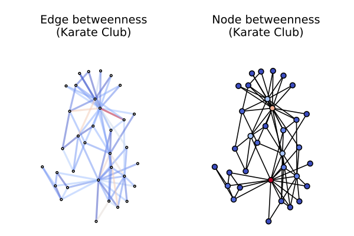
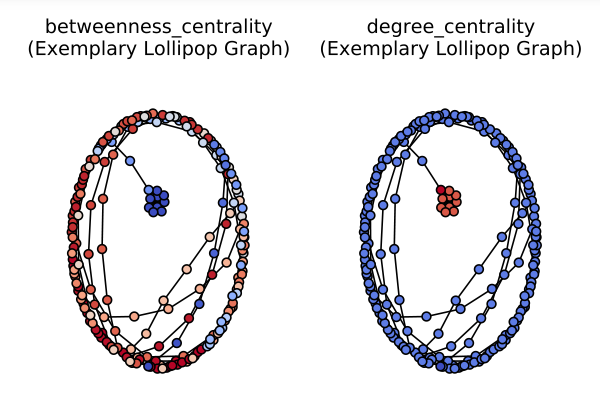

# An Introduction to Mining of Social Network Graphs

Konrad Talik, 2016.05.04

based on

Rajaraman, Anand, and Jeffrey D. Ullman. Mining of massive datasets. Chapter 10.

See [notebook](An Introduction to Mining of Social Network Graphs.ipynb).
